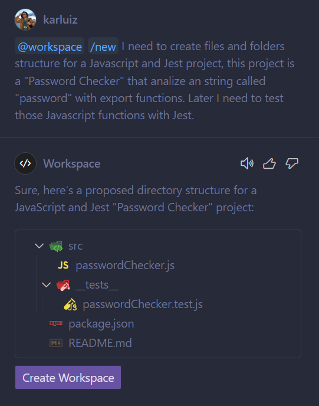
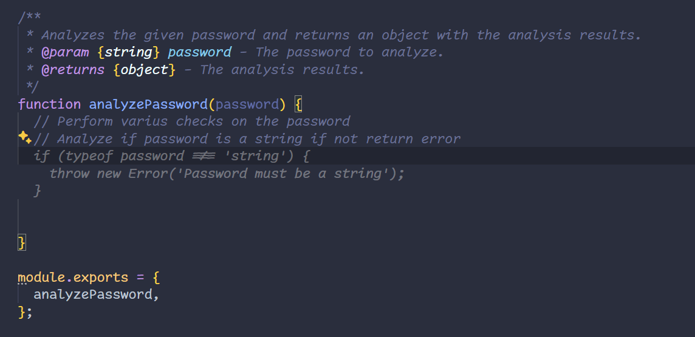

# vanilla-javascript-jest

simple usage of copilot for jest testing purposes

## Step 0: Open VS Code

In a terminal, open Visual Studio Code with the following command:

```bash
code .
```

## Step 1: usage of Copilot Chat to Create Project

```bash
@workspace /new I need to create files and folders structure for a Javascript and Jest project, this project is a "Password Checker" that analize an string called "password" with export functions. Later I need to test those Javascript functions with Jest.
```



Press Create Workspace

- Select a folder this will open a new session of VS Code.

With the following structure


- Open `passwordChecker.js` and add comments like this:

```javascript
  // Perform varius checks on the password
  // Analyze if password is a string if not return error
```

- The suggestions will appear above the comments

