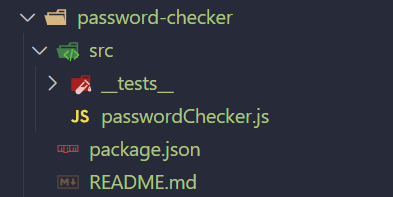
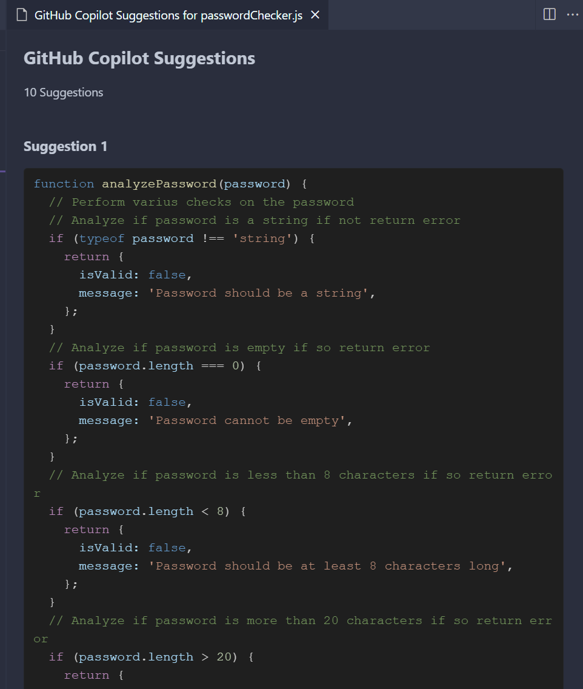

# GH Copilot Adoption Program - Jest Testing

Simple usage of characteristic of copilot for creating a project structure and comments, in this case a password checker project with Jest testing.

## Step 0: Open VS Code

In a terminal, open Visual Studio Code with the following command:

```bash
code .
```

## Step 1: usage of Copilot Chat to Create Project

```bash
@workspace /new I need to create files and folders structure for a Javascript and Jest project, this project is a "Password Checker" that analize an string called "password" with export functions. Later I need to test those Javascript functions with Jest.
```


Press Create Workspace

- Select a folder this will open a new session of VS Code.

With the following structure



- Open `passwordChecker.js` and add comments like this:

```javascript
  // Perform varius checks on the password
  // Analyze if password is a string if not return error
```

- The suggestions will appear above the comments


- You can accept the suggestions with `Tab` or `Enter` or you can do `Ctrl + Enter` to see all the suggestions in a new tab.



- You can review the suggestions and accept the ones you want.

- Now follow your instructor to continue with the project.


## Solved solutions

To se how solutions were solved, check the `solved` branch.

```bash
git checkout solved
```

